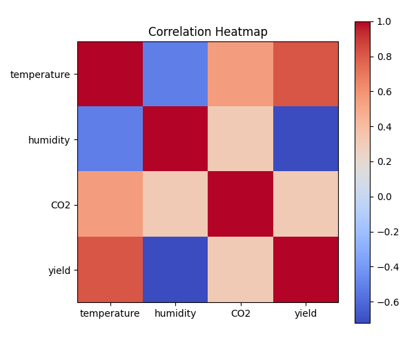
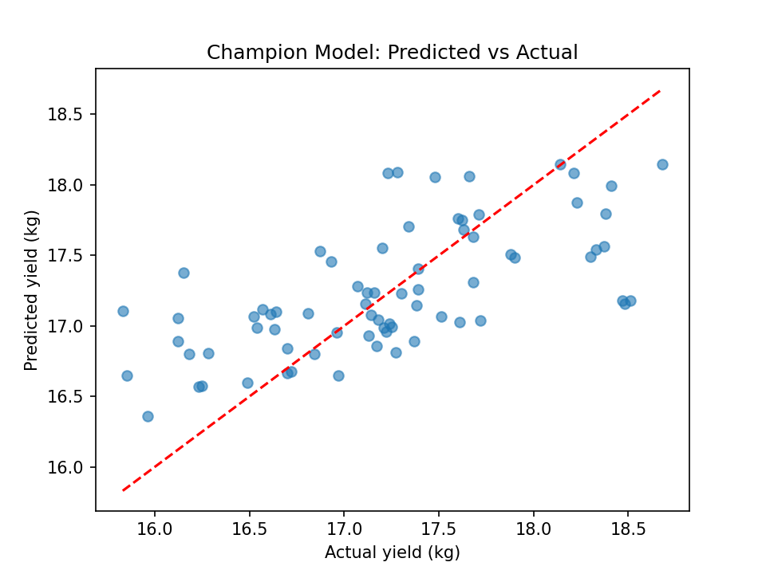
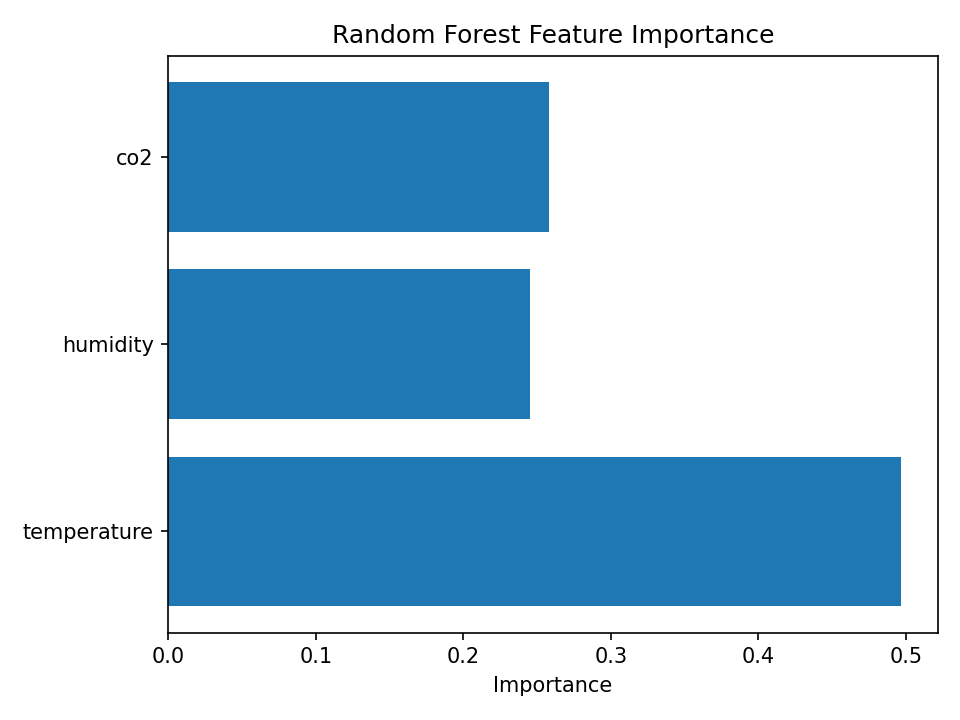
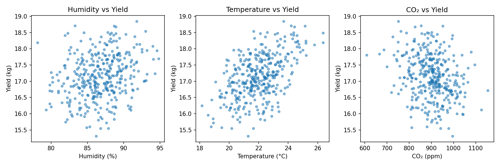

# Mushroom Yield Forecasting System

## Executive Summary

This project predicts daily mushroom yield using environmental sensor data collected from a polyhouse environment. Machine learning models were trained using temperature, humidity, and CO₂ measurements to estimate expected mushroom production. A Streamlit application was developed and deployed on Streamlit Community Cloud to provide real-time yield predictions.

---

# 1. Problem Statement

Mushroom cultivation is highly dependent on environmental conditions such as temperature, humidity, and carbon dioxide concentration. Small variations can significantly affect yield.

The objective of this project is to develop a machine learning system that predicts mushroom yield based on environmental sensor readings.

---

# 2. Data Description

The dataset contains polyhouse sensor measurements.

Features:

- Temperature (°C)
- Humidity (%)
- CO₂ (ppm)

Target Variable:

- Mushroom Yield (kg)

Data was collected and stored in CSV format.

---

# 3. Data Cleaning

The following preprocessing steps were performed:

- Removed invalid values
- Checked for missing values
- Standardized feature formats
- Verified data ranges
- Created cleaned datasets for model training

Cleaning details are documented in:

- cleaning_log.md
- reports/data_quality.md

---

# 4. Exploratory Data Analysis

EDA was performed to understand relationships between variables.

Key observations:

- Humidity shows positive influence on yield.
- Stable temperature improves production.
- CO₂ concentration affects growth rate.
- Feature relationships were visualized using correlation analysis.

Generated reports:

- reports/correlation_matrix.md
- reports/eda_summary.md

---

# 5. Feature Engineering

Features used:

- Temperature
- Humidity
- CO₂

Scaling was performed using MinMaxScaler.

Artifacts saved:

- models/minmax_scaler.joblib

---

# 6. Model Development

The following models were evaluated:

1. Linear Regression
2. Random Forest Regression
3. Tuned Random Forest

Evaluation metrics:

- MAE (Mean Absolute Error)
- RMSE (Root Mean Squared Error)
- R² Score

---

# 7. Model Selection

The Tuned Random Forest model achieved the best overall performance and was selected as the final model.

Final model:

- rf_tuned.joblib

Reasons:

- Lowest prediction error
- Better handling of nonlinear relationships
- Improved generalization performance

---

# 8. Deployment

A Streamlit web application was developed for inference.

Features:

- Interactive sliders
- Yield prediction
- Humidity sensitivity chart
- Model information panel

Deployment Platform:

- Streamlit Community Cloud

Live URL:

https://mushroom-yield-project-7nxbbbjsufc83coh3l6vz3.streamlit.app/

GitHub Repository:

https://github.com/LekshmiBiju/mushroom-yield-project.git

---

# 9. Monitoring and Logging

Prediction logging was implemented.

Logged fields:

- Timestamp
- Temperature
- Humidity
- CO₂
- Predicted Yield

Log file:

logs/predictions.csv

Monitoring activities:

- Data drift detection
- Input validation
- Prediction tracking
- Performance monitoring

Retraining triggers:

- Increased prediction error
- New sensor data availability
- Sensor calibration changes

---

# 10. Results

The system successfully predicts mushroom yield from environmental conditions.

Benefits:

- Supports farm decision-making
- Reduces manual estimation
- Enables data-driven cultivation

---

# 11. Limitations

Current limitations:

- Limited dataset size
- Dependence on sensor quality
- No real-time IoT integration
- Environmental factors beyond collected sensors are not included

---

# 12. Future Work

Future improvements include:

1. Real-time IoT sensor integration
2. Automated model retraining
3. Drift detection dashboard
4. Mobile application support
5. Additional environmental features

---

# 13. Reproducibility

Clone repository:

bash
git clone <repository-url>

Install dependencies:

bash
pip install -r requirements.txt

Run application:

bash
streamlit run app.py

Run tests:

bash
pytest tests/

# Figures

## Correlation Heatmap

## Predicted vs Actual

## Feature Importance

## Yield Scatter Plot

# Reflection

This capstone project helped me understand the complete machine learning workflow from data collection to deployment. I learned data cleaning, exploratory data analysis, feature engineering, model training, evaluation, Streamlit deployment, monitoring, and logging. The most valuable skills gained were machine learning model development, cloud deployment, and project documentation. Areas for future improvement include working with larger real-world datasets and implementing automated model retraining pipelines.
---

# Conclusion

This project demonstrates the successful application of machine learning and cloud deployment for agricultural yield prediction. The deployed system provides an accessible and scalable solution for predicting mushroom yield using environmental sensor data.